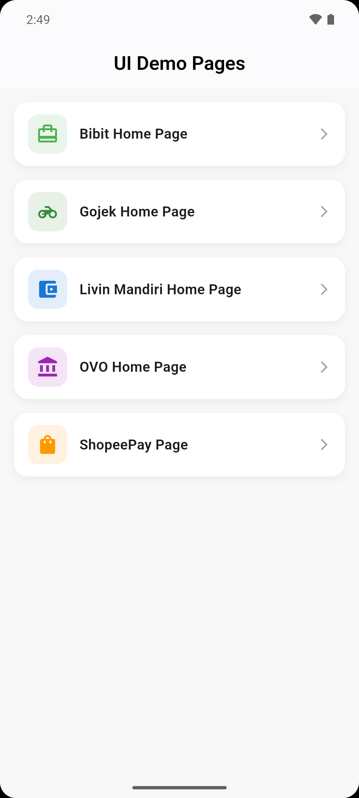
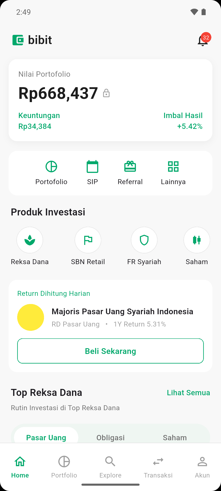
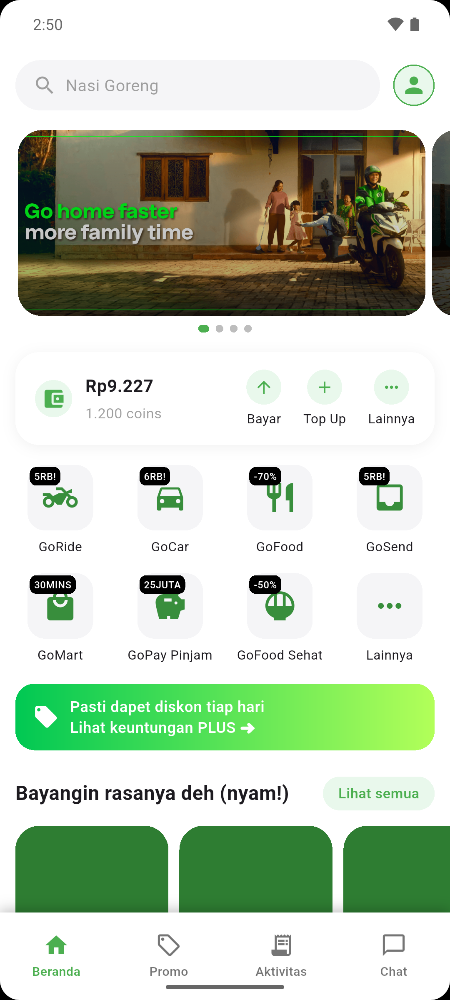
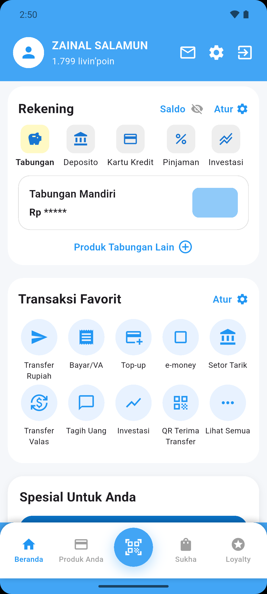
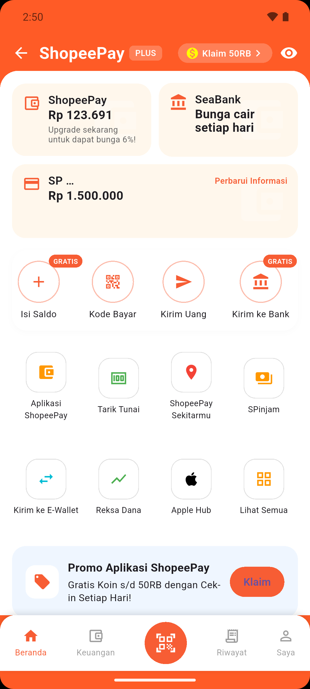

# 📱 Flutter UI Clone Showcase  
Koleksi halaman UI hasil latihan & eksplorasi desain dari berbagai aplikasi populer di Indonesia.  
Project ini berisi beberapa halaman home seperti:

- **Bibit Home Page**
- **Gojek Home Page**
- **Livin Mandiri Home Page**
- **OVO Home Page**
- **ShopeePay Page**

Semua halaman dapat diakses melalui 1 halaman utama:  
`AllPagesDemo` — yang menampilkan daftar menu dari masing-masing UI clone.

---

## 🚀 Features
- Tampilan UI modern & clean  
- Menggunakan Flutter Icons (tanpa asset logo tambahan)  
- Navigasi simple dengan `Navigator.push`  
- Struktur kode rapi dan mudah dikembangkan  
- Cocok untuk belajar layouting dan UI replication  

---

## 📂 Project Structure (Table Version)

| File | Deskripsi |
|------|-----------|
| `lib/all_pages_demo.dart` | Halaman utama berisi list menu UI |
| `lib/bibit_home_page.dart` | UI clone Bibit |
| `lib/gojek_home_page.dart` | UI clone Gojek |
| `lib/livin_home_page.dart` | UI clone Livin Mandiri |
| `lib/ovo_home_page.dart` | UI clone OVO |
| `lib/shopeepay_page.dart` | UI clone ShopeePay |

---

## 🧭 How to Run

```bash
flutter pub get
flutter run
Pastikan device/emulator sudah tersedia.

🖼 Screenshots
<table>
  <tr>
    <td></td>
    <td></td>
    <td></td>
    <td></td>
  </tr>
  <tr>
    <th>All Pages Demo</th>
    <th>Bibit Home</th>
    <th>Gojek Home</th>
    <th>Livin Home</th>
  </tr>
</table>

<br>

<table>
  <tr>
    <td></td>
    <td></td>
  </tr>
  <tr>
    <th>OVO Home</th>
    <th>ShopeePay Home</th>
  </tr>
</table>


🛠 Tech Stack
Flutter

Dart

Standard Material Widgets

No external UI libraries

📌 Notes
Project ini dibuat murni untuk keperluan belajar UI dan eksplorasi desain.
Tidak bermaksud meniru fungsi atau bisnis dari aplikasi asli.

🙌 Author
Developed with ❤️ by Zainal Salamun