# 📱 Flutter UI Clone Showcase  
Koleksi halaman UI hasil latihan & eksplorasi desain dari berbagai aplikasi populer di Indonesia.  
Project ini berisi beberapa halaman home seperti:

- **Bibit Home Page**
- **Gojek Home Page**
- **Livin Mandiri Home Page**
- **OVO Home Page**
- **ShopeePay Page**
- **Pintu Home Page**
- **Traveloka Home Page**
- **Aura Wallet**
- **Brewez Coffee**
- **Glossy Music**
- **Glossy Shop**
- **Habit Tracker**
- **Inventory App**
- **Lumina Home**
- **Notification Center**
- **Nova AI**
- **Shark Fit**
- **Talenta**
- **Task Manager**
- **Tix ID**
- **Zenith Task**

Semua halaman dapat diakses melalui 1 halaman utama:  
`AllPagesDemo` — yang menampilkan daftar menu dari masing-masing UI clone.

---

## 🚀 Features
- Tampilan UI modern & clean  
- Menggunakan Flutter Icons (tanpa asset logo tambahan)  
- Navigasi simple dengan `Navigator.push`  
- Struktur kode rapi dan mudah dikembangkan  
- Cocok untuk belajar layouting dan UI replication  

---

## 📂 Project Structure (Table Version)

| File | Deskripsi |
|------|-----------|
| `lib/all_pages_demo.dart` | Halaman utama berisi list menu UI |
| `lib/page_menu/bibit_home_page.dart` | UI clone Bibit |
| `lib/page_menu/gojek_home_page.dart` | UI clone Gojek |
| `lib/page_menu/livin_home_page.dart` | UI clone Livin Mandiri |
| `lib/page_menu/ovo_home_page.dart` | UI clone OVO |
| `lib/page_menu/shopeepay_page.dart` | UI clone ShopeePay |
| `lib/page_menu/pintu_home_page.dart` | UI clone Pintu |
| `lib/page_menu/traveloka_home_page.dart` | UI clone Traveloka |
| `lib/page_menu/aura_wallet` | UI clone Aura Wallet |
| `lib/page_menu/brewez_coffee` | UI clone Brewez Coffee |
| `lib/page_menu/glossy_music` | UI clone Glossy Music |
| `lib/page_menu/glossy_shop` | UI clone Glossy Shop |
| `lib/page_menu/habit_tracker` | UI clone Habit Tracker |
| `lib/page_menu/inventory_app` | UI clone Inventory App |
| `lib/page_menu/lumina_home` | UI clone Lumina Home |
| `lib/page_menu/notification_center` | UI clone Notification Center |
| `lib/page_menu/nova_ai` | UI clone Nova AI |
| `lib/page_menu/shark_fit` | UI clone Shark Fit |
| `lib/page_menu/talenta` | UI clone Talenta |
| `lib/page_menu/task_manager` | UI clone Task Manager |
| `lib/page_menu/tix_id` | UI clone Tix ID |
| `lib/page_menu/zenith_task` | UI clone Zenith Task |

---

### 📸 Screenshots
<table>
  <tr>
    <td>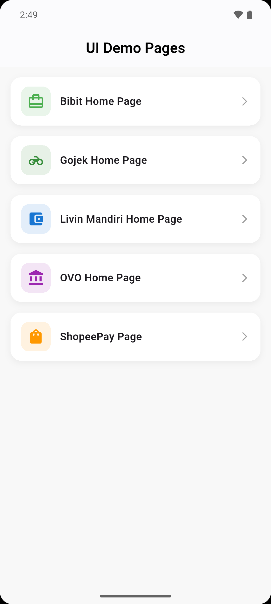</td>
    <td>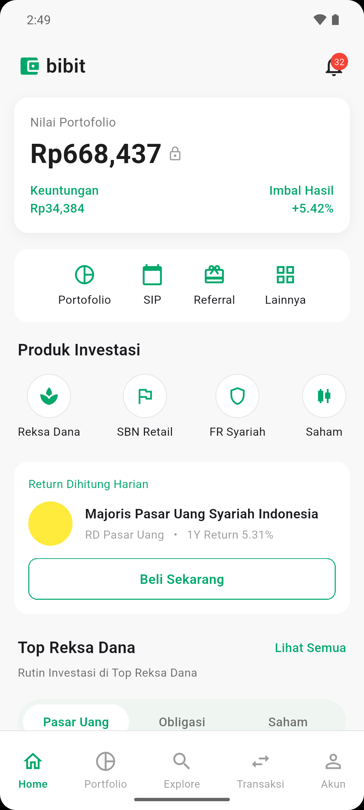</td>
    <td>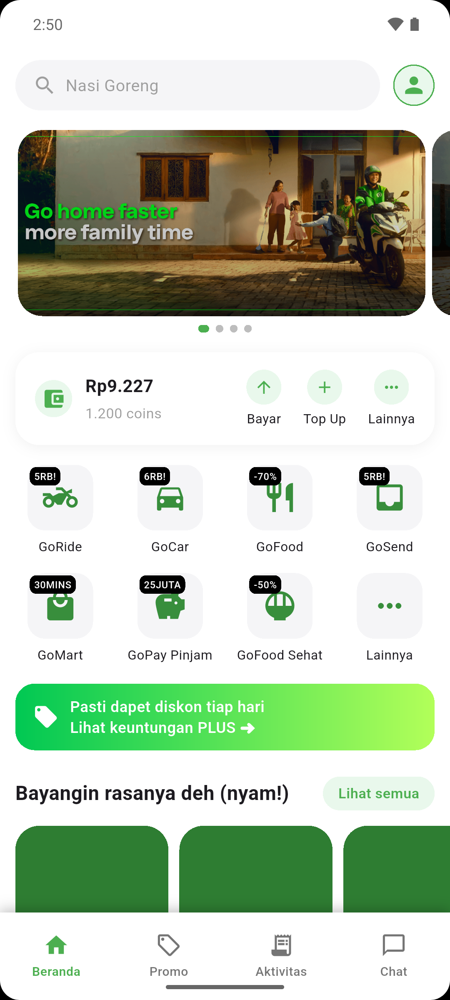</td>
    <td>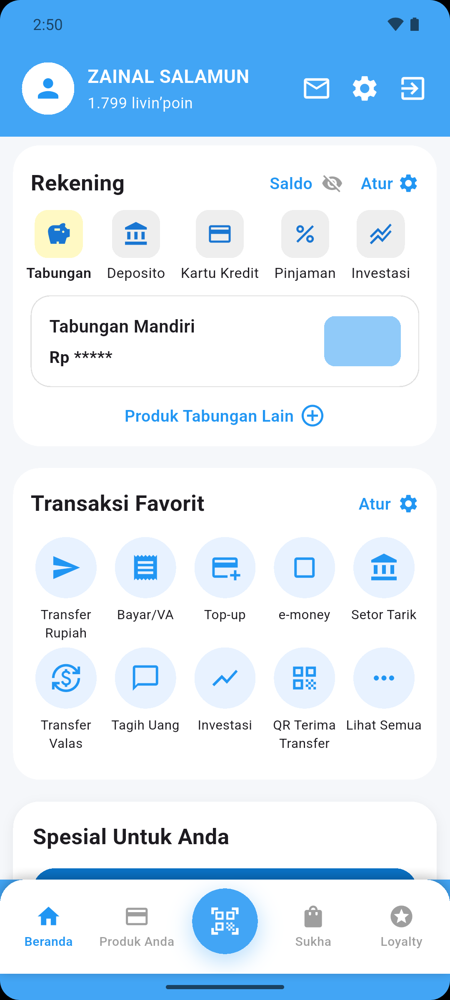</td>
  </tr>
  <tr>
    <th>All Pages Demo</th>
    <th>Bibit Home</th>
    <th>Gojek Home</th>
    <th>Livin Home</th>
  </tr>
</table>

<br>

<table>
  <tr>
    <td>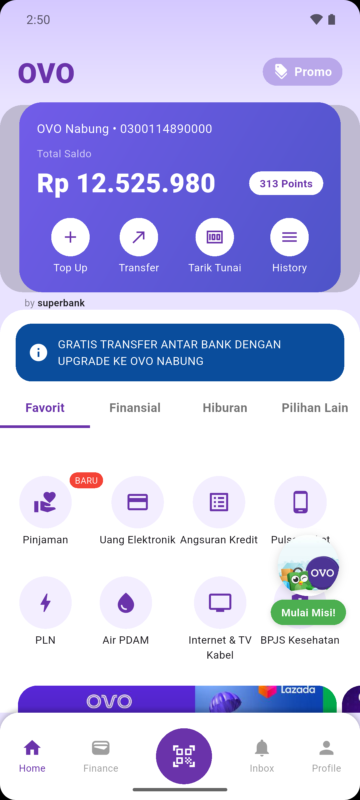</td>
    <td>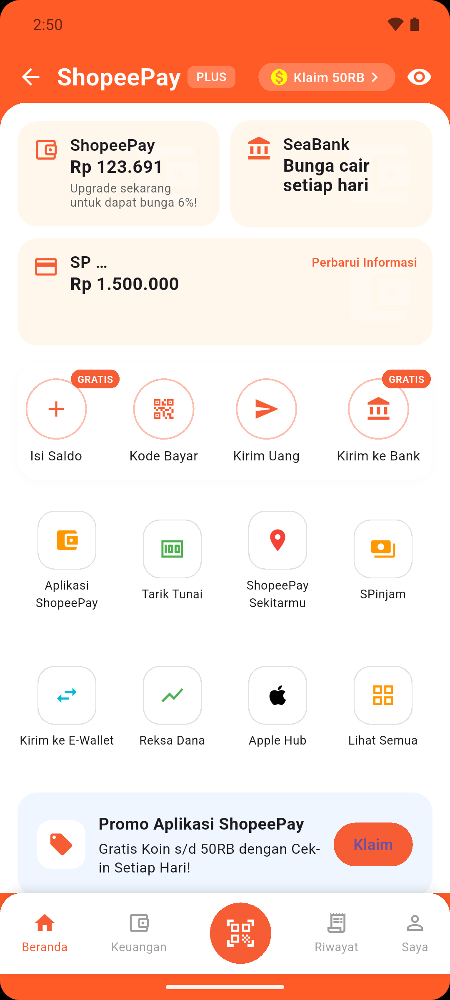</td>
    <td>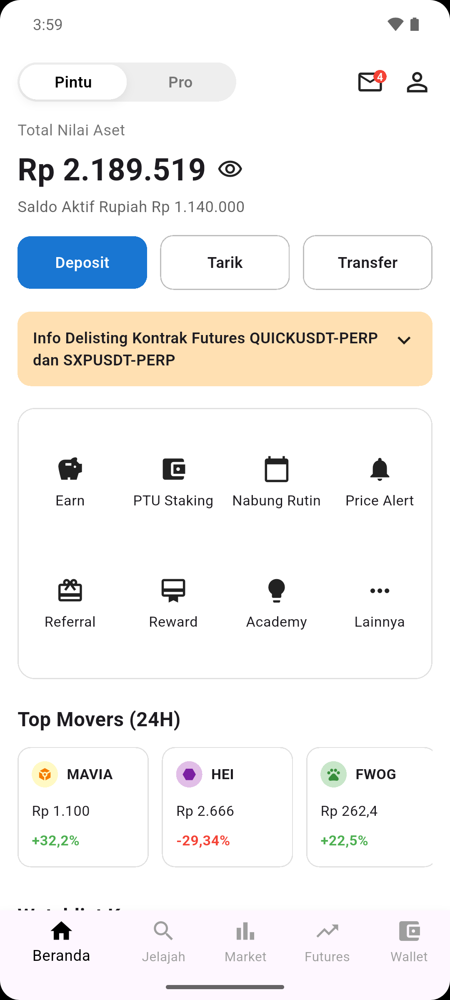</td>
    <td>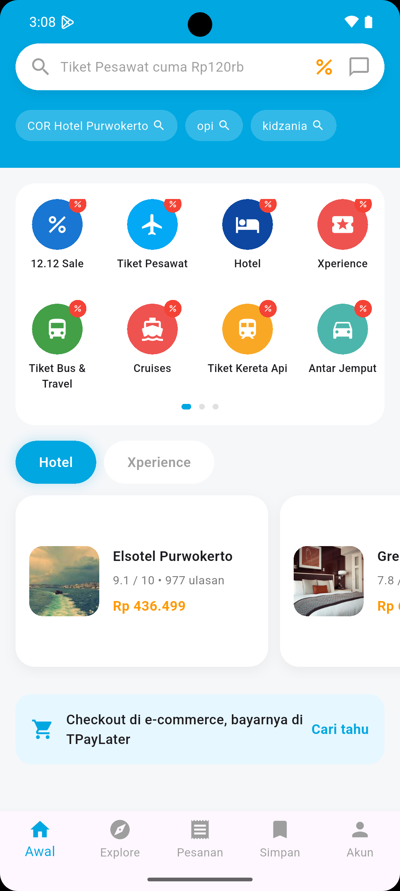</td>
  </tr>
  <tr>
    <th>OVO Home</th>
    <th>ShopeePay Home</th>
    <th>Pintu Home</th>
    <th>Traveloka Home</th>
  </tr>
</table>

<br>

<table>
  <tr>
    <td>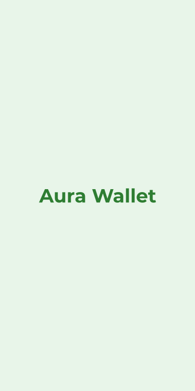</td>
    <td>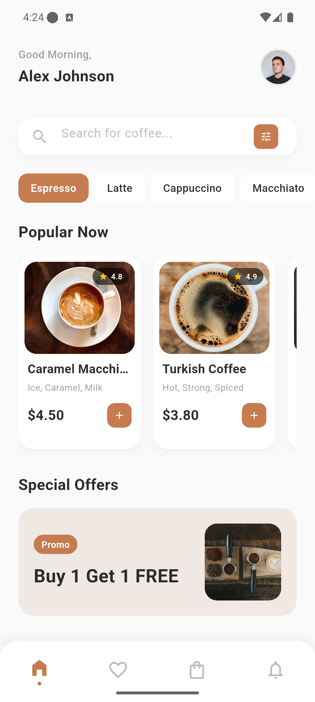</td>
    <td>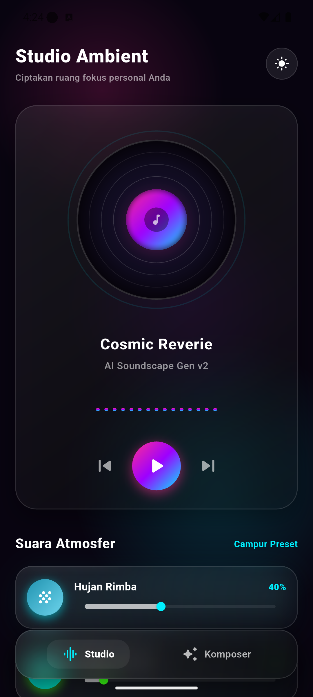</td>
    <td>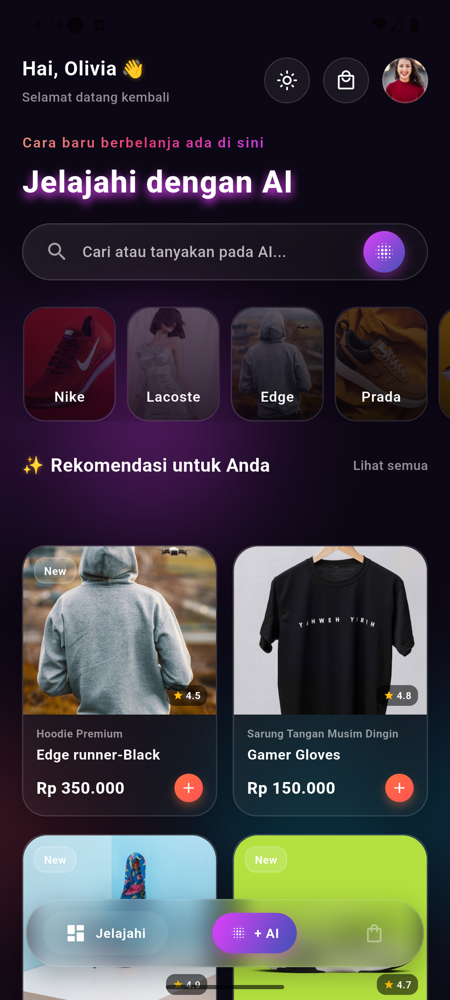</td>
  </tr>
  <tr>
    <th>Aura Wallet</th>
    <th>Brewez Coffee</th>
    <th>Glossy Music</th>
    <th>Glossy Shop</th>
  </tr>
</table>

<br>

<table>
  <tr>
    <td>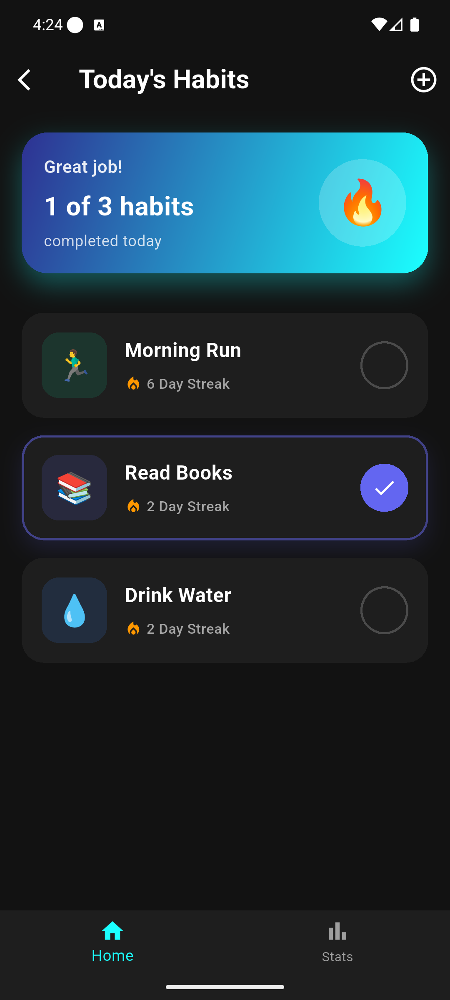</td>
    <td>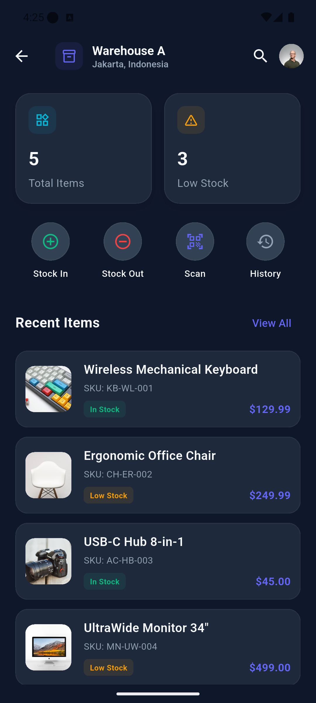</td>
    <td>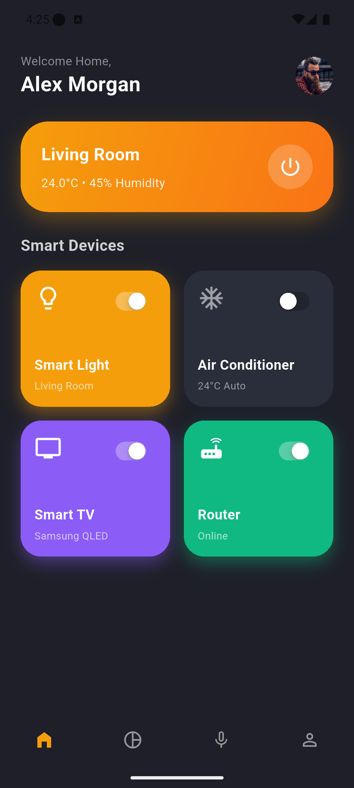</td>
    <td>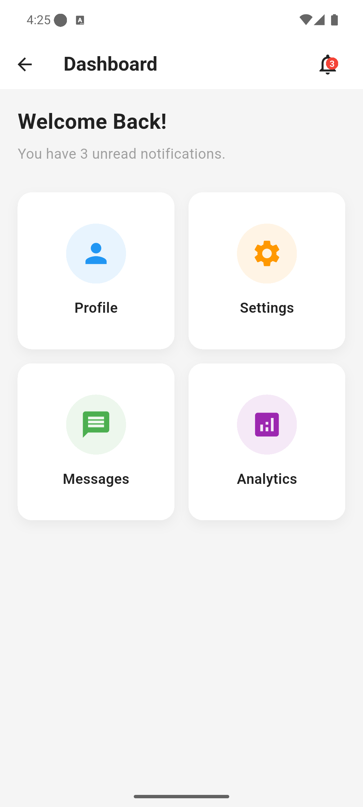</td>
  </tr>
  <tr>
    <th>Habit Tracker</th>
    <th>Inventory App</th>
    <th>Lumina Home</th>
    <th>Notification Center</th>
  </tr>
</table>

<br>

<table>
  <tr>
    <td>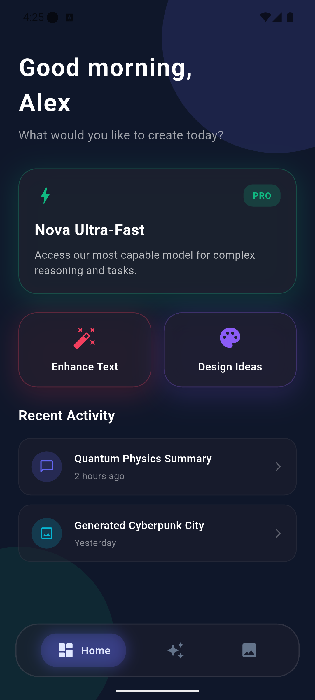</td>
    <td>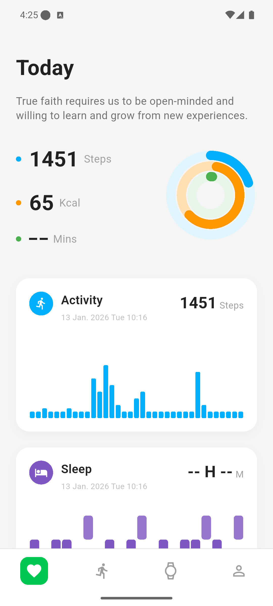</td>
    <td>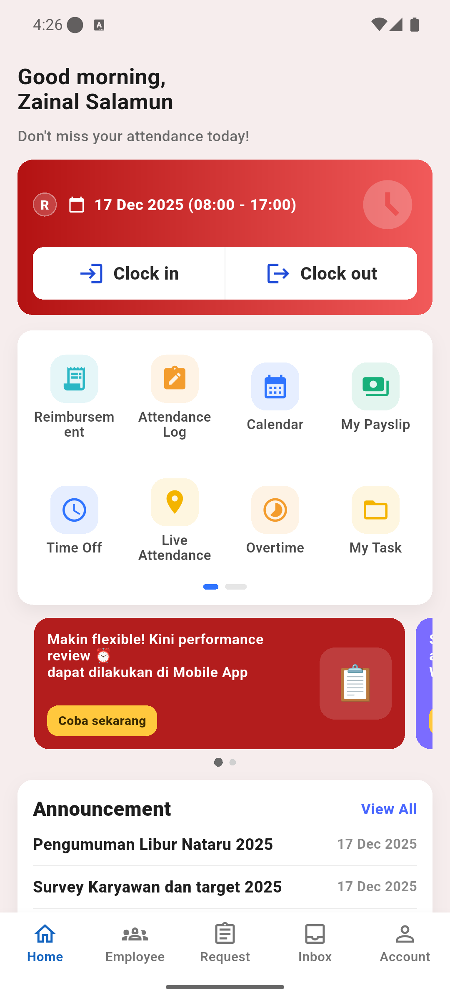</td>
    <td>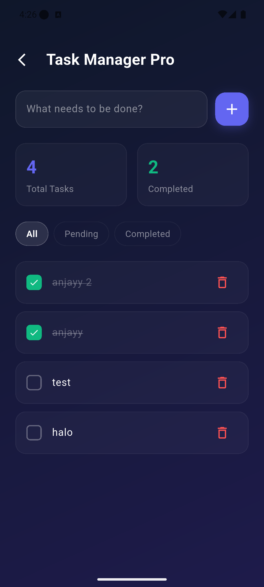</td>
  </tr>
  <tr>
    <th>Nova AI</th>
    <th>Shark Fit</th>
    <th>Talenta</th>
    <th>Task Manager</th>
  </tr>
</table>

<br>

<table>
  <tr>
    <td>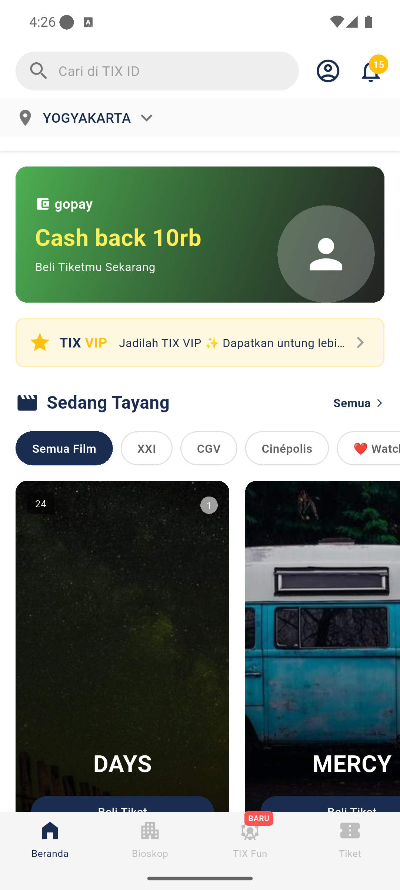</td>
    <td>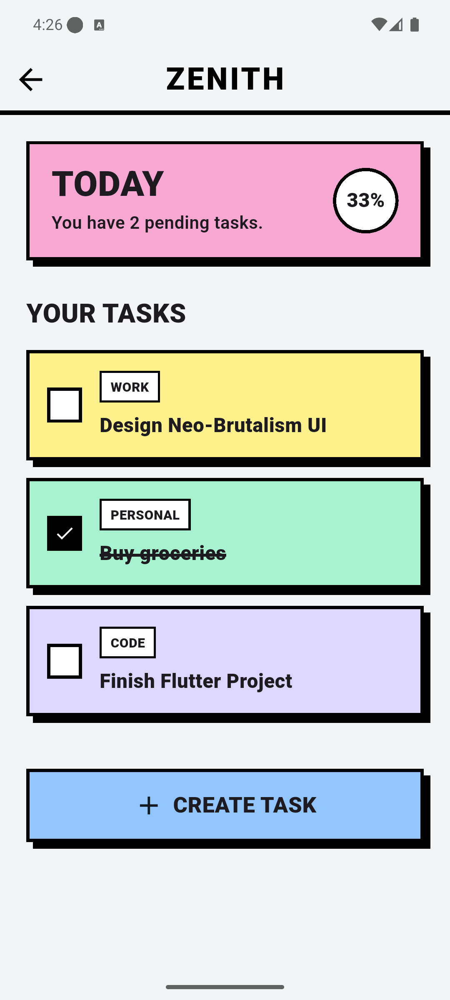</td>
    <td></td>
    <td></td>
  </tr>
  <tr>
    <th>Tix ID</th>
    <th>Zenith Task</th>
    <th></th>
    <th></th>
  </tr>
</table>


## 🧭 How to Run

```bash
flutter pub get
flutter run

🏗 How to Build (Release Build)
Build APK (universal)
flutter build apk --release

Build APK per ABI (lebih kecil)
flutter build apk --release --split-per-abi


Output ada di:

build/app/outputs/flutter-apk/

Build AppBundle (AAB) untuk Play Store
flutter build appbundle --release


Output ada di:

build/app/outputs/bundle/release/app-release.aab

🛠 Tech Stack
Flutter

Dart

Standard Material Widgets

No external UI libraries

📌 Notes
Project ini dibuat murni untuk keperluan belajar UI dan eksplorasi desain.
Tidak bermaksud meniru fungsi atau bisnis dari aplikasi asli.

🙌 Author
Developed with ❤️ by Zainal Salamun
